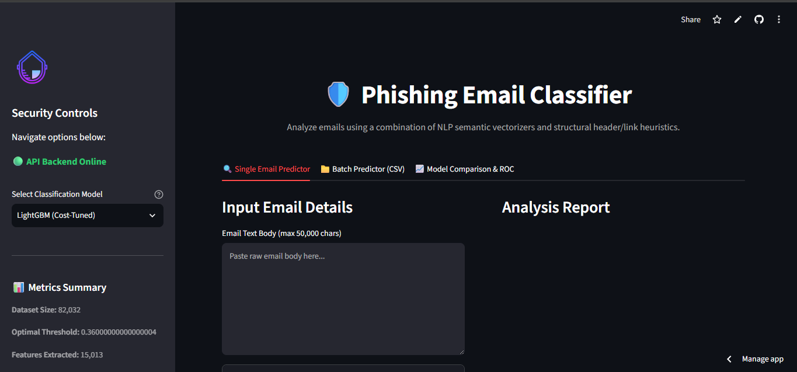
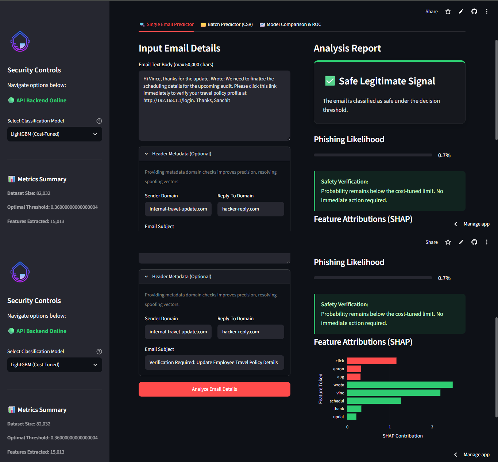
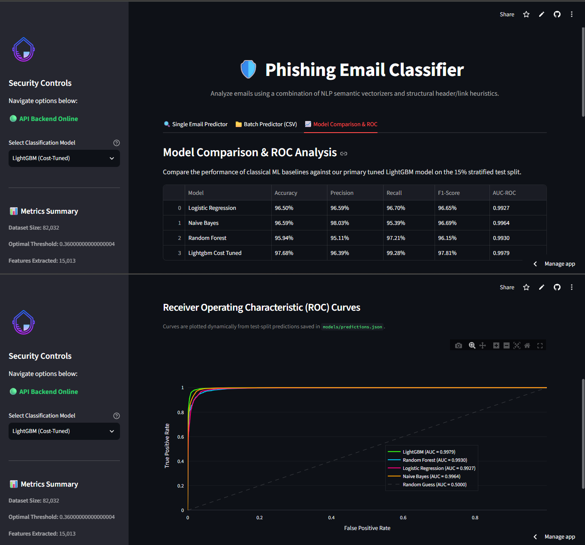

# AI-Driven Phishing Email Detection using NLP & Structural Heuristics

[](https://dangi-phishing-email-detection.streamlit.app/)
[](https://phishing-email-detection-flgr.onrender.com/health)

* **Live Dashboard Demo**: [dangi-phishing-email-detection.streamlit.app](https://dangi-phishing-email-detection.streamlit.app/)
* **Live FastAPI Endpoint**: [phishing-email-detection-flgr.onrender.com](https://phishing-email-detection-flgr.onrender.com/health)

An advanced machine learning and Natural Language Processing (NLP) system that classifies emails as Legitimate (Ham) or Phishing (Spam). This project establishes baseline TF-IDF and traditional classifiers (Logistic Regression, Naive Bayes, Random Forest), implements an optimized LightGBM gradient boosted decision tree classifier with cost-sensitive threshold tuning (minimizing false negatives to protect against credential theft), integrates local Explainable AI (SHAP) feature attributions, and provides a FastAPI endpoint and a Streamlit dashboard.

---

## 🧐 Problem Statement & Background
Phishing remains the primary vector for enterprise compromise. Automating its detection requires identifying both textual semantic patterns and structural signals (such as URL obfuscation and header mismatches).
1. **Cost Asymmetry**: In security, a False Negative (missing a phishing email) is significantly more dangerous than a False Positive (flagging a safe email). The classifier must tune its decision boundary accordingly.
2. **Textual vs. Structural Signals**: Deceptive emails use typical urgency language but also rely on technical indicators (like raw IP links or mismatched domains) that text-only vectorizers fail to capture.
3. **Explainability**: Security analysts need to know *why* an email was flagged (e.g., presence of exclamations, specific keywords, or suspicious links) to audit decisions instantly.

---

## 📊 Dataset Explanation & Preprocessing
The pipeline is trained and evaluated on a combined, stratified corpus of **82,032 emails** sourced from the Kaggle Phishing Dataset (integrating the Nazario phishing corpus and SpamAssassin ham/spam files):
- **Legitimate (Ham)**: 39,212 emails (47.8%) — Class `0`
- **Phishing (Spam)**: 42,820 emails (52.2%) — Class `1`

### Preprocessing Pipeline:
- **HTML Parsing**: HTML tags are parsed using BeautifulSoup. URLs and links are extracted *before* stripping tags since they serve as critical features.
- **Text Normalization**: Bodies are cleaned of formatting noise, lowercased, and tokenized.
- **Stopwords & Stemming**: Standard high-frequency English stopwords are removed, and tokens are stemmed using the NLTK Porter Stemmer to reduce dimensionality.

---

## 🛠️ Pipeline Architecture
```
[ Raw Email Input ] ──► [ Preprocessing (HTML strip, URL extract) ]
                              │
            ┌─────────────────┴─────────────────┐
            ▼ (Sparse Path)                     ▼ (Dense Path)
  [ TF-IDF Vectorizer ]               [ Structural Feature Engineering ]
  (15,000 Text Features)              (13 URL/Metadata Features)
            │                                   │
            └─────────────────┬─────────────────┘
                              ▼
                  [ Combined Feature Matrix ]
                        (15,013 Features)
                              │
            ┌─────────────────┼─────────────────┐
            ▼                 ▼                 ▼
     [ Logistic Reg. ]  [ Random Forest ]  [ LightGBM Classifier ]
            │                 │                 │
            └─────────────────┼─────────────────┘
                              ▼
                  [ Predict Probability ]
                              │
                              ▼
                  [ Cost-Sensitive Threshold ] (t=0.36)
                              │
                              ▼
                  [ Final Binary Label ] (Class 0 / 1)
                              │
                              ▼
                  [ SHAP Explainability Plot ]
```

---

## 📈 Model Comparison & Real Evaluation Metrics

Evaluation metrics calculated on the test split (15% stratified split, 12,305 samples):

| Model | Test Accuracy | Precision | Recall | F1-Score | AUC-ROC |
| :--- | :---: | :---: | :---: | :---: | :---: |
| **Logistic Regression** | 0.9650 | 0.9659 | 0.9670 | 0.9665 | 0.9927 |
| **Naive Bayes** (text-only) | 0.9659 | **0.9803** | 0.9539 | 0.9669 | 0.9964 |
| **Random Forest** | 0.9594 | 0.9511 | 0.9721 | 0.9615 | 0.9930 |
| **LightGBM** (default $t=0.50$) | **0.9811** | 0.9776 | 0.9863 | **0.9819** | **0.9979** |
| **LightGBM** (cost-tuned $t=0.36$) | 0.9768 | 0.9639 | **0.9928** | 0.9781 | **0.9979** |

*Note: Naive Bayes is trained on text features (TF-IDF) only due to distribution assumptions. Random Forest and LightGBM models leverage all 15,013 features (15,000 TF-IDF tokens + 13 dense structural/metadata features).*

---

## ⚠️ Performance Analysis & Known Limitations

### 1. Register / Genre Separation (Dataset Limitation)
The dataset diagnostics run on the combined 82k corpus revealed a significant register separation between classes:
- **Ham (Legitimate)** emails are heavily drawn from Enron corporate correspondence. The top correlated terms predicting legitimacy are corporate markers like `enron` (coef = -5.77), `wrote` (email quotation/replies, coef = -6.02), `thanks` (coef = -4.49), and names like `vince` (coef = -2.81).
- **Phishing (Spam)** emails are heavily drawn from generic mass-market spam, with top predictive terms being `money` (coef = +3.60), `click` (coef = +3.11), `account` (coef = +2.73), `replica` (coef = +2.66), and `watches` (coef = +2.07).

Consequently, the model is primarily learning to distinguish the *formal corporate/mailing-list register* from *commercial mass-spam*, rather than the more challenging, realistic security threat of **spear-phishing or Business Email Compromise (BEC)**. A high-fidelity phishing attempt (e.g., an email designed to look like a bank alert or internal IT alert) typically adopts a formal, corporate register and includes phrases like `thanks` or quotes text like `wrote:`. Under our current dataset configuration, such a targeted attack would likely be misclassified as ham (legitimate) because it lacks typical commercial spam keywords and displays corporate lexical characteristics. To test and generalize against this harder threat model in the future, we would need to supplement the corpus with high-fidelity, hand-crafted phishing templates designed to impersonate corporate communications rather than generic mass-spam.

### 2. Model Size Limits & Packaging
To stay within GitHub's 50 MB soft limit for model storage, the Random Forest model was trained with `max_depth=30`. This constrained model complexity and successfully kept `random_forest.pkl` at **20.3 MB** (down from 66 MB) without significant accuracy degradation. LightGBM remains extremely lightweight (~925 KB).

---

## 🚀 Step-by-Step Installation & Usage

### Prerequisites
* Python 3.11 environment (recommended)
* Git

### Local Setup & Package Installation
1. Clone the repository:
   ```bash
   git clone <repository-url>
   cd phishing-email-detection
   ```
2. Create and activate a Python virtual environment:
   * **macOS / Linux**:
     ```bash
     python3 -m venv venv
     source venv/bin/activate
     ```
   * **Windows (PowerShell)**:
     ```powershell
     python -m venv venv
     .\venv\Scripts\Activate.ps1
     ```
3. Install all required dependencies:
   ```bash
   pip install --upgrade pip
   pip install -r requirements.txt
   ```

### Local Application Execution
Once dependencies are installed, you can train models, generate local explanations, and launch the backend and frontend services locally:

1. **Train Model Pipeline**: Generates features and fits Logistic Regression, Naive Bayes, Random Forest, and LightGBM models:
   ```bash
   python src/train.py
   ```
2. **Generate SHAP Attributions**: Pre-computes SHAP local values and saves evaluation results:
   ```bash
   python src/explain.py
   ```
3. **Launch FastAPI Backend Service**: Starts the REST endpoint locally at `http://127.0.0.1:8000`:
   ```bash
   uvicorn api.main:app --host 127.0.0.1 --port 8000 --reload
   ```
4. **Launch Streamlit Dashboard**: Runs the frontend web interface (defaults to `http://localhost:8501`). The app will query the local FastAPI instance or fall back to local in-memory predictions if the API is offline:
   ```bash
   streamlit run app/streamlit_app.py
   ```

---

### 🐳 VS Code Dev Containers & Codespaces
The repository contains a `.devcontainer` configuration, allowing you to instantly launch a fully configured Python 3.11 environment in VS Code or GitHub Codespaces. On startup, the container automatically installs all dependencies from `requirements.txt` and runs the Streamlit dashboard app on port `8501`.

---

### Docker Containerization & Deployment
The repository includes a multi-stage [Dockerfile](file:///C:/Users/USER/.gemini/antigravity/scratch/phishing-email-detection/docker/Dockerfile) and [docker-compose.yml](file:///C:/Users/USER/.gemini/antigravity/scratch/phishing-email-detection/docker/docker-compose.yml) orchestrating the services.

> [!NOTE]
> **Verification Status**: Verified. The Docker configuration was successfully build-tested and deployed in the cloud environment on Render, hosting the active FastAPI backend service. The initial build compiled successfully, but returned a degraded startup state because `.gitignore` originally excluded the model weights (`models/*.pkl`). Once the `.gitignore` was corrected to whitelist the weights and the files were pushed, the redeployment completed in a fully healthy, operational state.

---

## 🖥️ Live Dashboard Visualizations
Here is the operational Streamlit dashboard running end-to-end against the live FastAPI Render service:

````carousel

<!-- slide -->

<!-- slide -->

````
